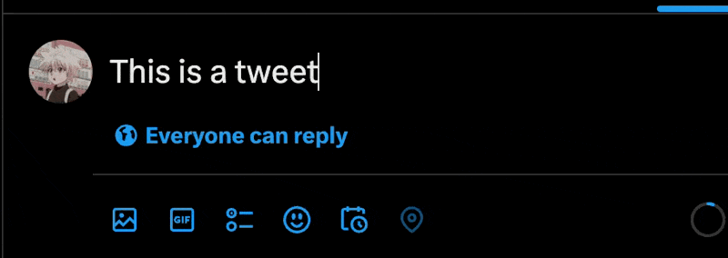

import minimalExtendLayer from "../../assets/minimal-extend-layer.png"
import Frame from "../../components/Frame.astro"

Learning Vim was one of the best investments I made. I use a Vim extension for VSCode and it's made navigating and editing code frictionless. The problem? Working with text outside VSCode feels like going back to the Stone Age. Whether it's fixing a typo in a URL, writing a tweet, selecting an item from a drop-down, this problem creeps up multiple times a day.

This can be resolved to some degree by using the "universal shortcuts". For example,

1. ⌥  + Left/Right moves the cursor by word:

2. ⌘ + ←/→ moves the cursor to the beginning and end of the line.

But this is still not ideal for someone who is accustomed to keeping their fingers on the home-row. Having to constantly move back and forth between writing and using the arrow keys breaks my flow.

I [asked](https://x.com/rafeytwt/status/1788863831143268528) Twitter for solutions but in vain.

I thought:
> It can't just be me. Surely, other people have had this problem too, right?

Enter the [Extend Layer](https://colemakmods.github.io/ergonomic-mods/extend.html).

<Frame src={minimalExtendLayer} caption="The Extend Layer"></Frame>

Think of a *layer* as a different "mode" or "level" of your keyboard. When you hold down `Fn`, you activate the "Function Layer" which remaps some of your Function Keys (F1-F12) to adjust volume or brightness. When you hold down `Shift`, you remap `a` to `A` and `1` to `!`. So you've already been using layers.

The Extend Layer simply extends (haha, geddit?) this concept to 
